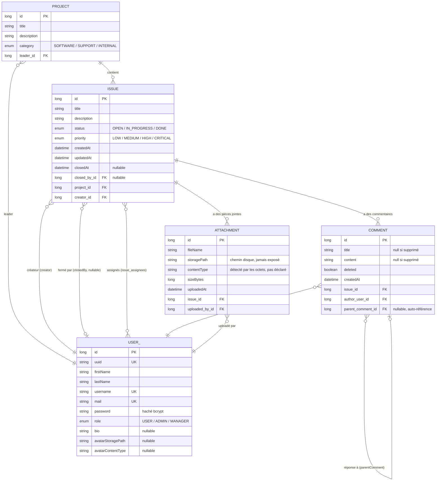

# Issue Tracker — Document d'explication complet

> **Comment utiliser ce document.** Ce fichier est écrit pour être donné tel
> quel à une IA qui va te servir de mentor/tuteur technique. Colle-lui ce
> document en lui disant : *"Voici un projet que j'ai réalisé en stage.
> Explique-moi chaque techno utilisée, fais-moi comprendre en profondeur
> comment il fonctionne pour que je sois capable de le refaire seul de zéro,
> et prépare-moi à le présenter à l'oral."* Le document ne remplace pas la
> lecture du code — il te donne la carte pour t'y retrouver, avec les
> chemins de fichiers réels du projet à chaque fois que c'est utile, pour
> que tu puisses aller vérifier par toi-même.
>
> Répertoire du projet : `issue-tracker-internship-beta/`
> Backend : `backend/` (Java/Spring Boot) — Frontend : `frontend/` (React/TypeScript)

---

## Table des matières

1. [Vue d'ensemble du projet](#1-vue-densemble-du-projet)
2. [Stack technique complet](#2-stack-technique-complet)
3. [Modèle de données complet](#3-modèle-de-données-complet)
4. [Architecture du projet](#4-architecture-du-projet)
5. [Chaque feature expliquée](#5-chaque-feature-expliquée)
6. [Lancer le projet en local](#6-lancer-le-projet-en-local)
7. [Glossaire](#7-glossaire)
8. [Points à savoir présenter en soutenance](#8-points-à-savoir-présenter-en-soutenance)

---

## 1. Vue d'ensemble du projet

**Issue Tracker** est une application web de gestion de tickets (issues),
dans l'esprit d'un Jira ou d'un Linear simplifié. Le principe général :
une organisation a des **projets** (ex: "Site vitrine", "App mobile"),
chaque projet contient des **issues** (des tickets : bugs, tâches, demandes),
et les utilisateurs collaborent dessus — ils créent des issues, se les
assignent, en discutent en commentaires, y attachent des fichiers, et les
font avancer à travers un cycle de statuts jusqu'à leur fermeture.

L'application a deux grandes parties qui communiquent entre elles par une
API REST au format JSON :

- **Un backend** (Java / Spring Boot) qui expose cette API, contient toute la
  logique métier et les règles de sécurité, et parle à une base de données
  PostgreSQL pour tout persister.
- **Un frontend** (React / TypeScript) qui est l'interface que l'utilisateur
  voit dans son navigateur : un tableau kanban (board), une vue liste
  triable, un panneau de détail d'issue, des pages de profil, etc. Le
  frontend ne fait aucun calcul métier lui-même — il appelle l'API et
  affiche ce qu'elle renvoie (à une exception près : il *prédit* certaines
  permissions pour une UX plus réactive, voir §5).

Ce qui rend le projet intéressant à expliquer (et à défendre à l'oral),
ce n'est pas la liste de fonctionnalités CRUD basiques, mais la façon dont
plusieurs problèmes "réels" ont été traités : qui a le droit de faire quoi
sur une issue (un système de permissions à deux niveaux), comment on empêche
qu'un utilisateur ressuscite un commentaire supprimé, comment on vérifie
qu'un fichier uploadé est vraiment une image et pas un exécutable déguisé,
comment on évite qu'Hibernate génère des centaines de requêtes SQL inutiles
en chargeant le détail d'une issue (le fameux "problème N+1"), etc.

Le projet est architecturé en couches très classiques côté backend
(Controller → Service → Repository) et en "feature folders" côté frontend
(chaque domaine métier — issues, projects, users, auth — a son propre
dossier avec ses appels API, ses types, ses hooks et ses composants). Ces
deux architectures sont décrites en détail en §4.

Le backend a 9 "features" numérotées issues d'un cahier des charges
(spec de stage, phase 2) : attachments, rôles/permissions, catégorie+leader
de projet, threads de commentaires, profil+recherche, tri/pagination,
fermeture d'issue, vue détail optimisée, séparation lecture/écriture par
permission, et édition de profil+avatar. Chacune est détaillée en §5, avec
les fichiers exacts où elle vit.

---

## 2. Stack technique complet

Cette section explique, techno par techno, **à quoi elle sert dans ce
projet précisément** (pas en général) et les concepts qu'il faut maîtriser
pour lire le code sans être perdu.

### 2.1 Backend

#### Java 21

Le langage du backend. Le projet cible Java 21 (voir `backend/pom.xml`,
propriété `<java.version>21</java.version>`) mais utilise surtout des
fonctionnalités disponibles depuis Java 17 (records, `var`, switch
expressions ne sont quasiment pas utilisés ici — le code reste dans un style
Java assez classique, orienté classes/objets).

**Concepts clés à connaître :**
- **Classe / objet / interface** : la base. `Issue` est une classe (une
  entité), `IssueRepository` est une interface implémentée automatiquement
  par Spring Data JPA (voir plus bas).
- **Annotations** (`@Entity`, `@Service`, `@Autowired` implicite via le
  constructeur...) : des métadonnées lues à l'exécution par des frameworks
  (Spring, Hibernate) pour générer du comportement sans que tu écrives ce
  code toi-même. C'est le mécanisme le plus important à comprendre pour lire
  ce projet — **90% de la "magie" Spring passe par des annotations**.
- **Génériques** (`GenericType<T>`, `PagedResponse<T>`, `JpaRepository<Issue,
  Long>`) : permettent d'écrire une classe qui fonctionne avec n'importe quel
  type, remplacé au moment de l'utilisation. `JpaRepository<Issue, Long>`
  veut dire "un repository pour l'entité `Issue`, dont la clé primaire est de
  type `Long`".
- **Streams** (`.stream().map(...).collect(Collectors.toList())`) : très
  utilisés dans les services pour transformer une liste d'entités en liste
  de DTOs (voir `IssueService.mapToDto`, appelé via `.map(this::mapToDto)`).

#### Spring Boot (4.1.0)

Le framework qui structure toute l'application backend. Spring Boot, c'est
Spring (un framework d'**injection de dépendances**) plus une couche
d'auto-configuration qui évite d'écrire du XML/config à la main.

**À quoi il sert ici :** il gère le serveur web intégré (Tomcat), le
routage des requêtes HTTP vers les bonnes méthodes Java (`@RestController`),
la configuration lue depuis `application.yml`, le lancement de l'application
(`IssueTrackerApplication.java`, la classe avec `public static void
main(...)`).

**Concepts clés :**
- **Bean** : un objet dont la création est déléguée à Spring (au lieu de
  faire `new MonService()` toi-même). Spring crée le bean une fois, le garde
  en mémoire (par défaut singleton), et l'injecte partout où on en a besoin.
- **Injection de dépendances (DI)** : au lieu qu'une classe crée elle-même
  les objets dont elle dépend, on les lui *donne* (typiquement via le
  constructeur). Exemple dans `IssueController.java` :
  ```java
  private final IssueService issueService;
  public IssueController(IssueService issueService) {
      this.issueService = issueService;
  }
  ```
  Spring voit qu'`IssueController` a besoin d'un `IssueService`, trouve le
  bean `IssueService` déjà créé (car annoté `@Service`), et l'injecte tout
  seul. Tu n'écris jamais `new IssueService(...)` dans ce projet.
- **Stéréotypes** : `@RestController` (une classe qui répond à des requêtes
  HTTP et renvoie du JSON), `@Service` (logique métier), `@Repository`
  (accès aux données), `@Component` (bean générique, utilisé ici pour les
  "security beans", voir §5.9). Ce sont tous des spécialisations de `@Bean`
  qui aident Spring (et le lecteur du code) à comprendre le rôle de chaque
  classe.
- **`application.yml` / profils** : `backend/src/main/resources/
  application.yml` contient la config commune (multipart, JWT...) ;
  `application-dev.yml` et `application-prod.yml` contiennent la config
  spécifique à un environnement (URL de la base, niveau de log...). Le
  profil actif est choisi par `SPRING_PROFILES_ACTIVE` (défaut `dev`).

#### Spring Web / Spring MVC (`spring-boot-starter-webmvc`)

Le sous-module qui gère concrètement le routage HTTP. Chaque
`@RestController` (ex: `IssueController`) définit des méthodes annotées
`@GetMapping`, `@PostMapping`, `@PutMapping`, `@PatchMapping`,
`@DeleteMapping` — chacune mappée à une route (`@RequestMapping("/api/
issues")` au niveau de la classe, puis un chemin relatif par méthode).

**Concepts clés :**
- `@PathVariable` (`{id}` dans l'URL), `@RequestParam` (`?page=0&size=10`),
  `@RequestBody` (le JSON envoyé dans le corps de la requête, désérialisé
  automatiquement en objet Java), `@Valid` (déclenche la validation Bean
  Validation, voir plus bas).
- `ResponseEntity<T>` : permet de contrôler explicitement le code HTTP de la
  réponse (`ResponseEntity.status(201).body(...)` pour une création, par
  exemple, au lieu du 200 par défaut).

#### Spring Data JPA + Hibernate

**JPA** (Jakarta Persistence API) est une spécification Java pour mapper des
objets à des tables de base de données (ORM = Object-Relational Mapping).
**Hibernate** est l'implémentation utilisée en coulisses par Spring Boot.
**Spring Data JPA** ajoute une couche par-dessus qui génère automatiquement
l'implémentation des repositories à partir d'une simple interface.

**À quoi ça sert ici :** chaque entité (`Issue`, `User`, `Project`,
`Comment`, `Attachment`) est une classe Java annotée `@Entity`, dont les
champs correspondent aux colonnes d'une table. Tu ne écris (quasiment)
aucun SQL toi-même — Hibernate génère les requêtes.

**Concepts clés (les plus importants du projet) :**
- **`@Entity` / `@Id` / `@GeneratedValue`** : marque une classe comme table,
  désigne sa clé primaire, et dit comment elle est générée
  (`GenerationType.IDENTITY` = auto-incrément côté base).
- **Relations** : `@ManyToOne`, `@OneToMany`, `@ManyToMany`. C'est LE
  concept à maîtriser pour comprendre le modèle de données (détaillé en
  §3). Exemple : `Issue.project` est `@ManyToOne` (plusieurs issues → un
  projet), `Project.issues` est `@OneToMany(mappedBy = "project")` (le
  côté "inverse" de la même relation, juste pour naviguer dans l'autre
  sens en Java).
- **Repository** : une interface qui étend `JpaRepository<Entité, TypeId>`
  et qui, par magie, obtient gratuitement `.save()`, `.findById()`,
  `.findAll()`, `.delete()`... Tu peux aussi déclarer des méthodes dont
  Spring Data JPA déduit la requête juste par le nom (ex :
  `findByUsername(String username)` dans `UserRepository` génère
  automatiquement `SELECT * FROM users WHERE username = ?`), ou écrire une
  requête JPQL explicite avec `@Query` quand le nom seul ne suffit pas (ex :
  `IssueRepository.findByFilters`, qui combine plusieurs filtres optionnels).
- **Lazy vs eager loading, et le problème N+1** : par défaut, une relation
  `@ManyToOne`/`@OneToMany` n'est chargée que quand on y accède réellement
  (lazy). Le risque : charger 20 issues puis afficher le nom de leur projet
  déclenche 20 requêtes SQL supplémentaires (une par issue) — c'est le
  "problème N+1". Ce projet le contourne avec `LEFT JOIN FETCH` dans les
  requêtes `@Query` (voir `IssueRepository.findDetailById`) : un `JOIN FETCH`
  dit à Hibernate "charge cette relation dans la même requête SQL, pas dans
  une requête séparée plus tard".
- **`MultipleBagFetchException`** : une limitation d'Hibernate — tu ne peux
  pas faire `JOIN FETCH` sur *deux* collections (`List`) en même temps dans
  la même requête (ça produirait un produit cartésien incohérent). C'est
  pour ça que `findDetailById` ne fetch-join que `assignees`, et que
  `comments`/`attachments` sont chargés par deux requêtes séparées dans
  `IssueService.getIssueById`. Comprendre cette limitation et comment le
  projet la contourne est un excellent point à savoir expliquer à l'oral.
- **`ddl-auto`** : en dev, Hibernate crée/modifie le schéma automatiquement
  à partir des entités (`ddl-auto=update`) — pratique pour développer vite,
  mais pas fiable en production (`ddl-auto=validate` en prod : Hibernate
  vérifie juste que le schéma correspond, sans le modifier). Ce projet n'a
  **pas** de vrai système de migration versionnée (Flyway/Liquibase) — c'est
  une dette technique assumée et documentée.
- **`@CreationTimestamp` / `@UpdateTimestamp`** (Hibernate) : remplissent
  automatiquement un champ date à la création/modification d'une ligne, sans
  code manuel (utilisé sur `Issue.createdAt/updatedAt`, `Comment.createdAt`,
  `Attachment.uploadedAt`).

#### PostgreSQL

La base de données relationnelle utilisée en production/dev
(`org.postgresql:postgresql`, dépendance scope `runtime` — le driver JDBC
qui permet à Java de parler à Postgres). Le projet n'utilise aucune
fonctionnalité Postgres-spécifique avancée (pas de JSONB, pas de full-text
search natif) : c'est du SQL relationnel standard, avec des clés étrangères
classiques et une table de jointure pour la relation many-to-many
(`issue_assignees`).

**Concept clé :** une base **relationnelle** stocke les données dans des
tables liées par des clés étrangères (foreign keys), par opposition à une
base NoSQL (documents, clé-valeur...). Ce projet est un cas d'école de
modèle relationnel bien normalisé (peu de duplication de données).

#### Spring Security + JWT (JJWT)

Gère l'authentification (qui es-tu ?) et l'autorisation (as-tu le droit de
faire ça ?).

**Concepts clés :**
- **Authentification stateless par JWT** : au lieu de garder une session
  côté serveur (comme avec des cookies de session classiques), le serveur
  signe un jeton (JWT = JSON Web Token) au login, que le client renvoie dans
  chaque requête (header `Authorization: Bearer <token>`). Le serveur n'a
  rien à stocker : il vérifie juste la signature du token à chaque requête.
  C'est pour ça que la config dit
  `sessionCreationPolicy(SessionCreationPolicy.STATELESS)`
  (`SecurityConfig.java`).
- **Un JWT a 3 parties** (header.payload.signature, encodées en base64) : un
  en-tête (algorithme), une charge utile (payload — ici le `username`,
  la date d'émission, la date d'expiration), et une signature calculée avec
  une clé secrète (`jwt.secret`, algorithme HS256). Si quelqu'un modifie le
  payload, la signature ne correspond plus et la vérification échoue.
- **Filtre de sécurité (`JwtAuthenticationFilter`)** : une classe qui
  étend `OncePerRequestFilter` et s'exécute **avant** que la requête
  n'atteigne le controller. Elle lit le header `Authorization`, extrait et
  valide le JWT (`JwtService`), et si tout est bon, remplit le
  `SecurityContextHolder` avec l'utilisateur authentifié — que le reste de
  l'application (les `@PreAuthorize`, `SecurityContextHolder.getContext().
  getAuthentication()`) peut ensuite consulter.
- **`@PreAuthorize`** : une annotation posée sur une méthode de controller,
  qui évalue une expression **SpEL** (Spring Expression Language) *avant*
  d'exécuter la méthode, et renvoie 403 si elle est fausse. Exemple :
  ```java
  @PreAuthorize("hasAnyRole('ADMIN','MANAGER') or @issueSecurity.isCreatorOrAssignee(#id, authentication)")
  ```
  `#id` référence le paramètre de méthode `id` (le path variable), et
  `@issueSecurity` référence un bean Spring nommé `"issueSecurity"` (voir
  §5.9 pour les "security beans" du projet — c'est le mécanisme
  d'autorisation le plus important à comprendre ici).
- **`BCryptPasswordEncoder`** : hache les mots de passe avant de les stocker
  (jamais en clair). BCrypt intègre un "salt" aléatoire et est volontairement
  lent (résistant au brute-force). Utilisé dans `AuthenticationService.
  register` (`passwordEncoder.encode(...)`) et vérifié automatiquement par
  `DaoAuthenticationProvider` au login.
- **`UserDetails`** : une interface Spring Security que la classe `User`
  implémente directement (voir `entity/User.java`) — c'est ce qui permet à
  Spring Security de traiter un `User` du projet comme "l'utilisateur
  authentifié" nativement, sans classe adaptateur séparée.
- **CORS** (`CorsConfigurationSource` dans `SecurityConfig`) : autorise le
  frontend (servi sur un port différent, `localhost:5173` en dev) à appeler
  l'API sans que le navigateur ne bloque la requête par sécurité.
- **CSRF désactivé** : pertinent pour une API stateless avec JWT (pas de
  cookies de session, donc pas de risque CSRF classique) — pour une appli
  web classique à base de cookies, il faudrait le garder activé.

#### Bean Validation (`spring-boot-starter-validation`, Jakarta Validation)

Annotations posées directement sur les champs des DTOs (`@NotBlank`,
`@NotNull`, `@Size`, `@Email`...) qui déclenchent une validation automatique
quand le controller reçoit `@Valid @RequestBody`. Si la validation échoue,
Spring lève une `MethodArgumentNotValidException`, interceptée par
`GlobalExceptionHandler` pour renvoyer un 400 propre avec le détail des
champs en erreur (voir `dto/IssueDto.java`, `dto/CommentDto.java`...).

#### Lombok

Une bibliothèque qui génère du code répétitif (boilerplate) à la
compilation via annotations, pour ne pas l'écrire à la main.

**Utilisé dans ce projet :**
- `@Data` : génère automatiquement les getters/setters, `equals()`,
  `hashCode()`, `toString()`. Utilisé sur **toutes** les entités et tous
  les DTOs (convention du projet : DTOs = classes `@Data`, jamais de
  `record` Java — un choix de cohérence, pas une contrainte technique).
- `@RequiredArgsConstructor` : génère un constructeur avec tous les champs
  `final` (utilisé pour l'injection de dépendances sans écrire le
  constructeur à la main, ex: `SecurityConfig`, `AuthenticationService`).
- `@AllArgsConstructor` : génère un constructeur avec tous les champs
  (utilisé sur `GenericType`, `PagedResponse`).

#### Apache Tika (`tika-core`)

Bibliothèque de détection de type de fichier par inspection des octets
réels (les "magic numbers" en tête de fichier — par exemple un PNG commence
toujours par les octets `89 50 4E 47`). Utilisée dans
`FileStorageService.detectContentType` pour **ne jamais faire confiance**
au `Content-Type` déclaré par le client lors d'un upload (facilement
falsifiable) — voir §5.1 et §5.10 pour le détail de cette faille corrigée.

#### Maven (`pom.xml`, `mvnw`)

L'outil de build du backend Java : il télécharge les dépendances (dans
`~/.m2`), compile le code, exécute les tests, et sait packager
l'application en `.jar` exécutable. Le "wrapper" (`mvnw`/`mvnw.cmd`) permet
de lancer Maven sans l'avoir installé globalement — il télécharge la bonne
version tout seul.

**Commandes essentielles** (déjà vues en §6) : `./mvnw compile`,
`./mvnw test`, `./mvnw spring-boot:run`.

---

### 2.2 Frontend

#### TypeScript

Un sur-ensemble de JavaScript qui ajoute un système de types statique,
vérifié à la compilation (`tsc`) avant même d'exécuter le code. Tout le
frontend est écrit en `.ts`/`.tsx` (le `x` = contient du JSX, la syntaxe
HTML-dans-JS de React).

**Concepts clés :**
- **`interface`** : décrit la forme d'un objet (ex : `interface Issue { id:
  number; title: string; ... }` dans `features/issues/types.ts`). Ces
  interfaces **miroitent volontairement** les DTOs backend, pour que les
  deux réalités (backend/frontend) restent faciles à comparer et à garder
  synchronisées quand l'API évolue.
- **Types unions littéraux** (`type Status = 'OPEN' | 'IN_PROGRESS' |
  'DONE'`) : reproduisent les enums Java côté frontend, avec la même
  sécurité (le compilateur refuse une valeur qui n'est pas dans la liste).
- **Génériques** (`GenericResponse<T>`, `PagedResponse<T>` dans
  `utils/apiTypes.ts`) : même idée qu'en Java, adaptée à TypeScript.
- **`type` vs `interface`** : le projet utilise surtout `interface` pour les
  formes d'objets/props de composants, et `type` pour les unions/alias.

#### React 19

La bibliothèque qui construit l'interface utilisateur en la découpant en
**composants** réutilisables, chacun étant une fonction qui prend des
`props` et retourne du JSX (une description de ce qui doit s'afficher).

**Concepts clés (essentiels pour ce projet) :**
- **Composant fonctionnel** : `export function IssueCard({ issue, ... }:
  IssueCardProps) { return <div>...</div> }`. C'est la seule forme utilisée
  ici (pas de composants classe, obsolètes).
- **`useState`** : donne à un composant une valeur qui, quand elle change
  (via son "setter"), déclenche un nouveau rendu. Exemple partout dans les
  hooks du projet : `const [issues, setIssues] = useState<Issue[]>([])`.
- **`useEffect`** : exécute du code en réaction à un rendu (typiquement,
  déclencher un appel API quand le composant apparaît, ou quand une
  dépendance change). Motif omniprésent dans ce projet : chaque hook de
  données (`useIssuesBoard`, `useIssueDetail`, `useProjects`...) suit le
  même patron :
  ```ts
  useEffect(() => {
    let cancelled = false
    setLoading(true)
    fetchSomething()
      .then((data) => { if (!cancelled) setData(data) })
      .catch((err) => { if (!cancelled) setError(...) })
      .finally(() => { if (!cancelled) setLoading(false) })
    return () => { cancelled = true } // évite de mettre à jour un composant démonté
  }, [dépendances])
  ```
  Comprendre ce patron par cœur, c'est comprendre la moitié du frontend.
- **`useMemo`** / **`useCallback`** : mémorisent respectivement une valeur
  calculée ou une fonction, pour ne pas la recalculer/recréer à chaque
  rendu (utilisé par exemple pour `projectsById` dans `IssuesView.tsx`, une
  `Map` reconstruite seulement quand `projects` change).
- **Props / composition** : les données descendent du parent vers l'enfant
  via les props (jamais l'inverse). Les callbacks (`onOpenIssue`,
  `onChanged`...) remontent l'information dans l'autre sens.
- **Hooks personnalisés** (`use...`) : des fonctions qui encapsulent de la
  logique réutilisable à base d'autres hooks. Tout le data-fetching du
  projet passe par des hooks maison (`useProjects`, `useIssuesBoard`,
  `useUsersLookup`...) plutôt que par une bibliothèque comme React Query —
  un choix simple et explicite, cohérent sur tout le projet.
- **Context API** (`createContext`/`useContext`) : partage une valeur
  (ici, l'utilisateur authentifié) à travers l'arbre de composants sans
  passer les props manuellement à chaque niveau. Voir `features/auth/
  auth-context.ts` + `AuthProvider.tsx` + `useAuth.ts`.

#### React Router (v7)

Gère la navigation côté client (changer d'URL sans recharger toute la
page) et le découpage de l'application en routes. Le projet utilise l'API
"data router" (`createBrowserRouter`, `frontend/src/routes/router.tsx`),
avec des routes imbriquées (nested routes) : une route "pathless" pour
`AuthProvider`, une autre pour `ProtectedRoute` (garde d'accès), puis
`AppShell` (la mise en page globale avec sidebar/topbar) qui contient
toutes les pages via `<Outlet />`.

**Concepts clés :**
- **Route imbriquée + `<Outlet />`** : un parent définit une mise en page
  commune, et `<Outlet />` est l'endroit où s'affiche la route enfant active.
- **`useParams`** : lit les segments dynamiques de l'URL (ex :
  `/projects/:projectId` → `useParams<{ projectId: string }>()` dans
  `ProjectBoardPage.tsx`).
- **`useNavigate`** : navigue par code (ex : après un login réussi).
- **`NavLink`** : comme `<a>`, mais qui sait détecter s'il correspond à
  l'URL active pour appliquer un style différent (utilisé dans `Sidebar.
  tsx`).

#### Axios

Un client HTTP (par-dessus l'API `fetch` du navigateur) utilisé pour tous
les appels au backend. Une seule instance centrale est créée dans
`utils/apiClient.ts` (`baseURL: '/api'`), avec deux **intercepteurs** :
- un intercepteur de **requête** qui attache automatiquement le token JWT
  (`Authorization: Bearer ...`) à chaque appel sortant ;
- un intercepteur de **réponse** qui détecte un `401` (token invalide/expiré)
  et déclenche une déconnexion propre partout dans l'app, sauf sur les
  routes `/auth/*` (pour ne pas confondre "mauvais mot de passe" avec
  "session expirée").

**Concept clé :** un **intercepteur** est une fonction qui s'exécute
automatiquement sur *chaque* requête ou réponse — un point central pour
appliquer une règle transversale (ici : authentification et gestion des
sessions expirées) sans la dupliquer dans chaque appel API.

#### Vite

L'outil de build/dev-server du frontend. En dev, il sert les fichiers avec
rechargement à chaud quasi instantané (HMR — Hot Module Replacement) ; en
prod, il bundle tout en fichiers JS/CSS optimisés (voir `npm run build`).
`vite.config.ts` configure aussi un **proxy** : toute requête vers `/api`
en dev est redirigée vers `http://localhost:8080` (le backend Spring), ce
qui évite les soucis de CORS en développement local et permet au frontend
de toujours parler à `/api` sans se soucier du port réel du backend.

#### CSS Modules + design tokens (pas de Tailwind)

Chaque composant a son propre fichier `Composant.module.css`, dont les
classes sont automatiquement "scopées" (renommées en interne) pour éviter
tout conflit de nom entre composants — pas besoin de convention type BEM.
Toutes les couleurs/espacements/tailles de police passent par des
**variables CSS** (design tokens) définies dans `frontend/src/index.css`
(`:root` = thème clair, `[data-theme='dark']` = thème sombre), ce qui
permet un thème clair/sombre cohérent sans dupliquer les styles.

#### oxlint

Un linter (analyseur statique qui détecte des erreurs/mauvaises pratiques)
rapide, utilisé à la place d'ESLint (`npm run lint` / `npx oxlint`).

---

## 3. Modèle de données complet

### 3.1 Vue d'ensemble (ERD)



> Note : l'entité `User` est nommée `USER_` dans le diagramme ci-dessus
> uniquement parce que `USER` est un mot réservé dans la syntaxe Mermaid —
> dans le code, la classe s'appelle bien `User` (table `users`, voir
> `@Table(name = "users")`).

### 3.2 Détail entité par entité

Tous les fichiers sont dans `backend/src/main/java/com/seilixx/
issuetracker/entity/`.

#### `User.java` — l'utilisateur

| Champ | Type | Détail |
|---|---|---|
| `id` | `long` | Clé primaire technique, auto-incrémentée. |
| `uuid` | `String` | Clé "métier" publique, unique, générée automatiquement (`@PrePersist`) à la création si absente. **C'est ce UUID, jamais `id`, qui apparaît dans l'API et les URLs** (`/api/users/{uuid}`) — l'`id` numérique reste un détail d'implémentation interne, jamais exposé. |
| `firstName`, `lastName`, `username`, `mail` | `String` | Identité. `username`/`mail` sont uniques (vérifié en base applicative avant insertion, pas de contrainte SQL `UNIQUE` explicite ajoutée par le code — à noter comme limite si on te pose la question). |
| `password` | `String` | Haché avec BCrypt, jamais en clair, jamais exposé dans un DTO. |
| `role` | `Role` (enum) | `USER` par défaut. Détermine les permissions globales (voir §5.9). |
| `bio` | `String` | Nullable, feature 10. |
| `avatarStoragePath`, `avatarContentType` | `String` | Nullable. Jamais une URL publique en dur — juste le chemin disque + le type MIME réel détecté ; l'URL servable (`/api/users/{uuid}/avatar`) est **calculée** à la volée dans le DTO, seulement si un avatar existe. |

`User implements UserDetails` (interface Spring Security) directement —
pas de classe adaptateur séparée. C'est ce qui permet à
`SecurityContextHolder.getContext().getAuthentication().getPrincipal()` de
renvoyer directement un objet `User` utilisable partout dans le code métier.

#### `Project.java` — le projet

| Champ | Type | Détail |
|---|---|---|
| `id` | `long` | PK. |
| `title`, `description` | `String` | — |
| `category` | `ProjectCategory` (enum) | `SOFTWARE`, `SUPPORT` ou `INTERNAL`. Modifiable **seulement** par un admin via un endpoint dédié (voir §5.3). |
| `leader` | `User` (`@ManyToOne`, non-null) | Le "chef" du projet — a des droits étendus sur les issues du projet (voir §5.9). |
| `issues` | `List<Issue>` (`@OneToMany`, cascade + orphanRemoval) | Supprimer un projet supprime en cascade toutes ses issues. |

#### `Issue.java` — le ticket

| Champ | Type | Détail |
|---|---|---|
| `id` | `long` | PK. |
| `title`, `description` | `String` | — |
| `status` | `Status` (enum) | `OPEN` → `IN_PROGRESS` → `DONE`. `DONE` est **terminal** (voir §5.7 — règle métier centrale du projet). |
| `priority` | `Priority` (enum) | `LOW`/`MEDIUM`/`HIGH`/`CRITICAL`. |
| `createdAt`, `updatedAt` | `LocalDateTime` | Remplis automatiquement par Hibernate (`@CreationTimestamp`/`@UpdateTimestamp`). |
| `closedAt` | `LocalDateTime` (nullable) | Rempli uniquement au passage à `DONE`. |
| `closedBy` | `User` (`@ManyToOne`, nullable) | Qui a fermé l'issue — pris automatiquement de l'utilisateur authentifié au moment de la transition. |
| `project` | `Project` (`@ManyToOne`) | — |
| `creator` | `User` (`@ManyToOne`) | Le "reporter" — pris du principal authentifié à la création, **jamais** du corps de la requête (empêche de créer une issue au nom de quelqu'un d'autre). |
| `assignees` | `List<User>` (`@ManyToMany`, table `issue_assignees`) | Les personnes assignées. Une vraie table de jointure (`issue_id`, `user_id`), pas de colonne dupliquée. |
| `comments` | `List<Comment>` (`@OneToMany`, cascade + orphanRemoval) | — |
| `attachments` | `List<Attachment>` (`@OneToMany`, cascade + orphanRemoval) | — |

#### `Comment.java` — le commentaire (thread)

| Champ | Type | Détail |
|---|---|---|
| `id` | `long` | PK. |
| `title`, `content` | `String` | Mis à `null` par la suppression (soft-delete, voir plus bas). |
| `issue` | `Issue` (`@ManyToOne`) | — |
| `authorUser` | `User` (`@ManyToOne`) | — |
| `parentComment` | `Comment` (`@ManyToOne`, nullable) | **Auto-référence** : un commentaire peut pointer vers un autre commentaire de la même entité, ce qui construit un thread/arbre de réponses. `null` = commentaire de premier niveau. |
| `deleted` | `boolean` | `false` par défaut. **Soft-delete** : supprimer un commentaire ne l'enlève jamais de la base — ça met `deleted=true` et vide `title`/`content`. Les réponses existantes gardent un `parentCommentId` stable (elles ne "perdent" pas leur parent), et l'API renvoie un placeholder `"[comment deleted]"` à la place du contenu réel. |
| `createdAt` | `LocalDateTime` | `@CreationTimestamp`, nullable en base (ajouté après coup, voir §5.4). |

#### `Attachment.java` — la pièce jointe

| Champ | Type | Détail |
|---|---|---|
| `id` | `long` | PK. |
| `issue` | `Issue` (`@ManyToOne`, non-null) | — |
| `fileName` | `String` | Nom **d'affichage** (celui envoyé par le client) — jamais utilisé comme nom de fichier réel sur disque. |
| `storagePath` | `String` | Le vrai chemin sur disque, avec un nom **généré** (UUID), jamais exposé dans l'API. |
| `contentType` | `String` | Le type MIME **réellement détecté** par inspection des octets (Apache Tika), pas celui déclaré par le client (voir §5.1/§5.10). |
| `sizeBytes` | `long` | — |
| `uploadedBy` | `User` (`@ManyToOne`, non-null) | — |
| `uploadedAt` | `LocalDateTime` | `@CreationTimestamp`. |

### 3.3 Les enums (`entity/Status.java`, `Priority.java`, `Role.java`,
`ProjectCategory.java`)

Des `enum` Java simples, stockées en base comme des chaînes de caractères
(`@Enumerated(EnumType.STRING)` — plus lisible et plus sûr en base que
`ORDINAL`, qui casserait tout si on réordonne les valeurs) :

```java
public enum Status { OPEN, IN_PROGRESS, DONE }
public enum Priority { LOW, MEDIUM, HIGH, CRITICAL }
public enum Role { USER, ADMIN, MANAGER }
public enum ProjectCategory { SOFTWARE, SUPPORT, INTERNAL }
```

Ces mêmes valeurs sont reproduites **à l'identique** côté frontend en
TypeScript (`frontend/src/utils/apiTypes.ts`) sous forme de types union
littéraux — une source de vérité dupliquée volontairement, à garder
synchronisée manuellement si un jour on ajoute une valeur.

---

## 4. Architecture du projet

### 4.1 Backend — architecture en couches (package-by-layer)

```
backend/src/main/java/com/seilixx/issuetracker/
├── entity/       → les tables (voir §3)
├── repository/   → l'accès aux données (interfaces Spring Data JPA)
├── service/      → la logique métier (LA couche qui décide "qui a le droit
│                   de faire quoi", applique les règles comme "une issue
│                   fermée est terminale", mappe entité ↔ DTO)
├── controller/   → les endpoints REST (parsing HTTP, appel du service,
│                   emballage de la réponse)
├── dto/          → les objets échangés avec le client (jamais les entités
│                   directement — voir pourquoi ci-dessous)
├── security/     → JWT (filtre, service), config Spring Security, et les
│                   "security beans" utilisés par @PreAuthorize
└── exception/    → exceptions métier custom + leur mapping HTTP centralisé
```

**Le flux d'une requête typique** (exemple : `PATCH /api/issues/{id}/status`) :

1. `JwtAuthenticationFilter` intercepte la requête *avant* Spring MVC,
   valide le JWT, place l'utilisateur authentifié dans le
   `SecurityContextHolder`.
2. Spring Security évalue le `@PreAuthorize` de la méthode du controller
   (`IssueController.updateStatus`) — si ça échoue, 403 immédiat, la méthode
   n'est même pas appelée.
3. `IssueController.updateStatus` reçoit la requête (URL + corps JSON
   validé par `@Valid`), extrait les paramètres, et **délègue tout** à
   `IssueService.updateStatus(id, status)` — le controller ne contient
   quasiment aucune logique.
4. `IssueService` charge l'entité via `IssueRepository`, applique la règle
   métier (refuse si déjà `DONE`), modifie l'entité, la sauvegarde, la
   convertit en DTO (`mapToDto`), et la retourne.
5. `IssueController` emballe le DTO dans un `GenericType<IssueDto>` et
   renvoie une `ResponseEntity` avec le bon code HTTP.
6. Si une exception métier a été levée à l'étape 4 (ex :
   `IssueClosedException`), elle traverse toute la pile jusqu'à
   `GlobalExceptionHandler` (`@RestControllerAdvice`), qui la traduit en
   réponse HTTP propre (409, dans ce cas) — **un seul endroit** gère ce
   mapping pour toute l'application, pas de `try/catch` dispersé partout.

**Pourquoi des DTOs séparés des entités ?** Deux raisons concrètes, visibles
dans ce projet :
- Ne jamais exposer de champs sensibles/internes (`User.password`,
  `Attachment.storagePath`) au client, même par accident.
- Contrôler *précisément* quels champs un client peut modifier via un
  endpoint donné. Exemple concret et important : `IssueUpdateRequest`
  (utilisé par `PUT /api/issues/{id}`) **n'a pas de champ `status`** — le
  seul moyen de changer le statut d'une issue est le endpoint dédié `PATCH
  /api/issues/{id}/status`, qui applique une autorisation *différente et
  plus stricte* (`isCreatorOrAssignee`, pas `isCreatorOrAssigneeOrProjectLeader`)
  et la règle "issue fermée = terminale". Si `status` était dans le DTO
  général, ce garde-fou serait contournable. Même logique pour
  `ProjectUpdateRequest` qui n'a pas de `category` (modifiable seulement par
  un admin via `PATCH /api/projects/{id}/category`).

### 4.2 Frontend — architecture "feature folders"

```
frontend/src/
├── components/           → composants UI génériques et réutilisables,
│   └── layout/              indépendants du métier (AvatarChip, Skeleton,
│                             StatusBadge, EmptyState...) + la mise en page
│                             globale (AppShell, Sidebar, Topbar)
├── features/
│   ├── auth/              → login/register/session (AuthProvider, hooks,
│   │                         pages, garde de route)
│   ├── issues/             → tout ce qui concerne les issues : board,
│   │                         liste, panneau de détail, commentaires,
│   │                         attachments, permissions calculées
│   ├── projects/           → liste de projets, page de board filtrée par
│   │                         projet, en-tête avec le leader
│   └── users/               → profil, édition de profil, avatar, recherche
├── providers/              → contextes transverses (thème clair/sombre)
├── routes/router.tsx        → l'arbre de routes complet de l'application
└── utils/                   → apiClient (axios), types partagés miroir du
                                backend, formatage (dates, octets...)
```

Chaque dossier de `features/` suit systématiquement le même patron :
- `api.ts` — les fonctions qui appellent l'API (une fonction par endpoint,
  toutes basées sur `apiClient`) ;
- `types.ts` — les interfaces TypeScript qui décrivent les données ;
- `hooks/` — la logique de state + effets (fetch, cache, mutations) ;
- `components/` — les composants React qui affichent ces données, en
  recevant tout par props (pas d'appel API direct dans un composant de
  présentation — l'appel passe toujours par un hook).

**Exemple concret de bout en bout** (afficher le board d'issues) :
`IssuesView.tsx` (la page) appelle le hook `useProjects()`
(`features/projects/hooks/useProjects.ts`) pour charger les projets, et
passe le résultat à `IssueBoard.tsx`
(`features/issues/components/IssueBoard.tsx`), qui lui-même appelle le hook
`useIssuesBoard()` (`features/issues/hooks/useIssuesBoard.ts`) pour charger
les issues filtrées. `useIssuesBoard` appelle `fetchIssues()`
(`features/issues/api.ts`), qui utilise `apiClient.get('/issues', {
params: ... })`. Le composant `IssueBoard` ne sait rien d'axios ni de
l'URL de l'API — il ne connaît que `{ issues, loading, error, refetch }`.

**Pas de bibliothèque de state management globale** (pas de Redux, pas de
Zustand, pas de React Query) : chaque hook gère son propre state local avec
`useState`/`useEffect`, avec un patron de "cache" simple là où c'est utile
(voir `features/users/userCache.ts`, un `Map` module-scope qui évite de
re-fetcher le même utilisateur plusieurs fois pendant la session).

---

## 5. Chaque feature expliquée

Chaque sous-section correspond à une feature numérotée du cahier des
charges (sauf mention contraire), avec : ce qu'elle fait, où elle vit dans
le code, et pourquoi elle a été construite ainsi.

### 5.1 Feature 1 — Attachments (pièces jointes)

**Ce que ça fait :** uploader un fichier sur une issue, lister/télécharger/
supprimer les pièces jointes.

**Où :** `controller/AttachmentController.java`, `service/
AttachmentService.java`, `service/FileStorageService.java` (backend) ;
`features/issues/components/IssueAttachmentsSection.tsx` (frontend).

**Choix de design :**
- Le fichier est stocké sur disque sous un **nom généré aléatoirement**
  (UUID), jamais le nom fourni par le client
  (`FileStorageService.store()`) — ça élimine tout risque de *path
  traversal* (un nom de fichier du style `../../etc/passwd` ne peut jamais
  atteindre le système de fichiers réel).
- Le `Content-Type` stocké n'est **pas** celui déclaré par le client
  (`MultipartFile.getContentType()`, facilement falsifiable en renommant
  un fichier), mais celui détecté par inspection des octets réels via
  Apache Tika (`FileStorageService.detectContentType`). Un fichier dont le
  type détecté ne figure pas dans l'allowlist configurée
  (`ATTACHMENTS_ALLOWED_TYPES`) est rejeté, même avec un nom et un
  `Content-Type` déclaré parfaitement légitimes.
- Upload bloqué si l'issue est déjà fermée (`Status.DONE`) — cohérent avec
  la règle "issue fermée = terminale" (feature 7).

### 5.2 Feature 2 — Rôles et permissions (`@PreAuthorize`)

**Ce que ça fait :** trois rôles (`USER`, `MANAGER`, `ADMIN`), avec des
droits globaux croissants. Un `MANAGER`/`ADMIN` peut agir sur n'importe
quelle issue/projet ; un `USER` est limité par son lien avec la ressource
(voir §5.9 pour le détail du système à deux niveaux).

**Où :** annotations `@PreAuthorize` sur chaque controller, `entity/
Role.java`, `security/SecurityConfig.java` (`@EnableMethodSecurity` active
ce mécanisme). Auto-promotion bloquée explicitement dans
`UserService.updateUserRole` (un utilisateur ne peut pas changer son
propre rôle, même s'il est admin — garde applicative en plus de
`@PreAuthorize("hasRole('ADMIN')")`).

### 5.3 Feature 3 — Catégorie et leader de projet

**Ce que ça fait :** chaque projet a une catégorie (`SOFTWARE`/`SUPPORT`/
`INTERNAL`) et un leader (un `User`).

**Où :** `entity/Project.java`, `controller/ProjectController.java`
(`PATCH /api/projects/{id}/category`, admin-only), `dto/
ProjectUpdateRequest.java` (volontairement sans `category`, voir §4.1),
`features/projects/components/ProjectHeader.tsx` (affichage du leader côté
frontend, résolu via `useUsersLookup([project.leaderUuid])`).

**Pourquoi séparer la modification de catégorie du reste ?** Même logique
que `status` sur les issues : la catégorie est plus sensible que le
titre/description/leader (elle a un impact sur le filtrage/l'organisation
globale), donc elle a son propre endpoint avec une autorisation plus
stricte (`hasRole('ADMIN')` uniquement, pas `MANAGER`).

### 5.4 Feature 4 — Commentaires en thread

**Ce que ça fait :** des commentaires avec réponses imbriquées
(threading), et une suppression "douce" (soft-delete) qui garde le thread
intact.

**Où :** `entity/Comment.java` (`parentComment` auto-référencé, `deleted`),
`service/CommentService.java`, `features/issues/components/
IssueCommentsSection.tsx` (calcule la profondeur visuelle de chaque
réponse en remontant la chaîne `parentCommentId`, plafonnée
visuellement à 3 niveaux).

**Règle métier notable :** `CommentService.updateComment` vérifie
explicitement `comment.isDeleted()` **avant** toute modification, et lève
une `CommentDeletedException` (409) si le commentaire est supprimé. Sans
cette vérification, un utilisateur pourrait "ressusciter" un commentaire
supprimé en le ré-écrivant via `PUT /api/comments/{id}` — puisque
`authorUser` n'est jamais effacé par le soft-delete, la vérification
d'autorisation `@commentSecurity.isAuthor` continuerait de passer. C'est un
excellent exemple à citer à l'oral d'un bug de logique métier trouvé et
corrigé (pas juste "codé sans réfléchir aux cas limites").

`createdAt` sur `Comment` est rempli automatiquement par Hibernate
(`@CreationTimestamp`) et affiché côté frontend via `formatRelativeDate`
(`utils/format.ts`) — "il y a 5 minutes", etc.

### 5.5 Feature 5 — Profil utilisateur + recherche

**Ce que ça fait :** une page de profil publique par utilisateur (bio,
avatar, ses issues assignées/fermées, paginées), et une recherche
d'utilisateurs par nom/prénom/username/email.

**Où :** `controller/UserController.java` (`GET /api/users/{uuid}/
profile`, `GET /api/users/search`), `repository/UserRepository.search`
(requête JPQL avec `LIKE` insensible à la casse sur 4 champs),
`features/users/ProfilePage.tsx`, `UserSearchPage.tsx`.

**Limite connue et assumée :** `GET /users/{uuid}/profile` applique le
même couple `page`/`size` aux deux listes (issues assignées et issues
fermées) — pas de pagination indépendante sans changer la forme de
l'endpoint. Documenté plutôt que caché — savoir citer une limite connue
plutôt que prétendre que tout est parfait est un bon réflexe pour la
soutenance.

### 5.6 Feature 6 — Tri et pagination des issues

**Ce que ça fait :** la liste d'issues (`GET /api/issues`) est paginée
(`page`/`size`) et triable sur 4 champs (`status`, `priority`,
`createdAt`, `updatedAt`), dans les deux sens (`asc`/`desc`).

**Où :** `service/IssueService.getIssuesByFilters` (construit un objet
`Sort` Spring Data, avec un **tri secondaire stable par `id`** — sans ça,
deux issues ayant exactement le même statut pourraient apparaître dans un
ordre différent d'une page à l'autre, un bug classique et sournois de
pagination), `features/issues/components/IssueTable.tsx` (en-têtes de
colonnes cliquables côté frontend).

### 5.7 Feature 7 — Fermeture d'issue (règle métier centrale)

**Ce que ça fait :** fermer une issue (`status = DONE`) est une transition
**terminale** — une fois fermée, plus aucune modification n'est possible
(ni statut, ni champs, ni nouvel attachment) tant qu'elle reste `DONE`.

**Où :** `service/IssueService.updateStatus` et `updateIssue` vérifient
tous les deux `if (issue.getStatus() == Status.DONE) throw new
IssueClosedException(...)` **avant** toute modification. `closedAt`/
`closedBy` sont remplis automatiquement à la transition vers `DONE`
(jamais fournis par le client). `IssueClosedException` est mappée à un
**409 Conflict** par `GlobalExceptionHandler` — le code HTTP le plus
sémantiquement correct pour "ta requête est valide, mais l'état actuel de
la ressource l'interdit" (à distinguer d'un 400, qui voudrait dire "ta
requête elle-même est malformée").

**Choix de design à savoir défendre :** cette règle est vérifiée **dans le
service**, pas dans le controller ni côté frontend seul. Le frontend la
reproduit aussi (pour désactiver les boutons proactivement, meilleure UX),
mais le backend reste la seule source de vérité — même si quelqu'un
contourne le frontend et appelle l'API directement, la règle tient.

### 5.8 Feature 8 — Vue détail complète sans N+1

**Ce que ça fait :** `GET /api/issues/{id}` renvoie l'issue avec **tout**
ce dont l'UI a besoin en un minimum de requêtes SQL : projet, créateur,
qui l'a fermée, assignés, commentaires, pièces jointes.

**Où :** `repository/IssueRepository.findDetailById` (`LEFT JOIN FETCH` sur
`project`/`creator`/`closedBy`/`assignees`), complété par deux requêtes
séparées et déjà optimisées dans `CommentRepository.findDetailByIssueId` et
`AttachmentRepository.findDetailByIssueId` (chacune avec son propre `JOIN
FETCH` sur l'auteur/l'uploadeur). **Trois requêtes SQL au total**, au lieu
d'une explosion en dizaines de requêtes si chaque relation était chargée
paresseusement une par une.

**Pourquoi trois requêtes et pas une seule ?** À cause du
`MultipleBagFetchException` d'Hibernate expliqué en §2.1 — on ne peut
`JOIN FETCH` qu'**une seule** collection (`List`) par requête. `assignees`
est la seule collection fetch-jointe dans la requête principale ;
`comments` et `attachments` (les deux autres collections de `Issue`) sont
donc chargées séparément, chacune déjà optimisée pour éviter son propre
N+1 sur l'auteur/l'uploadeur.

### 5.9 Feature 9 — Séparation visibilité vs permission d'écriture

**C'est le cœur du système d'autorisation du projet — la feature la plus
importante à savoir expliquer en détail.**

**Principe général :** la **lecture** (`GET`) est ouverte à tout
utilisateur authentifié, sans restriction supplémentaire (cohérent avec
l'esprit d'un outil de suivi d'équipe — tout le monde voit tout).
L'**écriture** (`POST`/`PUT`/`PATCH`/`DELETE`) est restreinte selon deux
axes combinés :

1. **Par rôle global** : un `ADMIN`/`MANAGER` peut presque tout faire,
   partout.
2. **Par lien avec la ressource** (pour un `USER` simple), avec **deux
   niveaux de granularité différents** sur les issues :
   - **Périmètre étroit** (`IssueSecurity.isCreatorOrAssignee`) — reporter,
     assigné, manager ou admin : peut **commenter** et **changer le
     statut**.
   - **Périmètre large** (`IssueSecurity.isCreatorOrAssigneeOrProjectLeader`)
     — le périmètre étroit **+ le leader du projet** : peut **éditer les
     champs de l'issue** et **attacher un fichier**.

**Comment c'est implémenté techniquement :** des "security beans" — des
classes `@Component("nomDuBean")` (`IssueSecurity`, `AttachmentSecurity`,
`CommentSecurity`, dans `security/`), chacune avec des méthodes qui
prennent l'ID de la ressource + l'`Authentication` courante, **rechargent
la ressource depuis la base** (jamais confiance dans un champ du body de la
requête — protection anti-IDOR), et comparent le propriétaire/l'assignation
réels. Ces beans sont référencés par leur nom dans l'expression SpEL de
`@PreAuthorize` :

```java
@PreAuthorize("hasAnyRole('ADMIN','MANAGER') or @issueSecurity.isCreatorOrAssigneeOrProjectLeader(#id, authentication)")
```

**Pourquoi recharger la ressource plutôt que faire confiance au body ?**
Exemple concret d'IDOR (Insecure Direct Object Reference) que ce pattern
empêche : si l'autorisation se basait sur un champ envoyé par le client
(ex: "je suis l'auteur, croyez-moi sur parole"), n'importe qui pourrait
mentir dans le corps de sa requête. En rechargeant systématiquement la
ressource par son ID et en comparant son propriétaire réel en base,
l'autorisation ne peut jamais être falsifiée côté client.

**Côté frontend**, `features/issues/permissions.ts`
(`computeIssuePermissions`) **reproduit fidèlement les mêmes règles**, mais
calculées côté client à partir de l'utilisateur authentifié — uniquement
pour désactiver/masquer proactivement les actions non permises dans l'UI
(meilleure UX, pas de bouton actif qui échoue systématiquement). Le
backend reste la seule source de vérité : chaque action mutante gère
quand même un éventuel 403/409 renvoyé par le serveur (rollback optimiste
sur le board en cas de drag&drop refusé, bannière d'erreur sur le panneau
de détail).

### 5.10 Feature 10 — Édition de profil + avatar

**Ce que ça fait :** un utilisateur peut éditer son propre profil (prénom,
nom, bio) et uploader/recadrer un avatar.

**Où :** `service/UserService.updateMyProfile`/`updateMyAvatar`
(résolvent toujours l'utilisateur **courant** via
`SecurityContextHolder`, sans jamais accepter d'UUID en paramètre — il est
donc **structurellement impossible** d'éditer le profil de quelqu'un
d'autre par cet endpoint, pas besoin de vérification supplémentaire).
Frontend : `features/users/ProfileEditPage.tsx`, `components/
AvatarCropper.tsx` (un cropper fait maison en Canvas natif, sans
dépendance externe — zoom/pan, export fixe 320×320 en PNG).

Même durcissement de sécurité que pour les attachments (§5.1) : le type de
l'avatar est vérifié par les octets réels (Tika), pas par le
`Content-Type` déclaré, avec une allowlist dédiée image-only et un plafond
de taille de 3 Mo, séparés de l'allowlist générale des attachments.

### 5.11 Authentification frontend (login / register / sessions)

**Ce que ça fait :** un vrai flux d'authentification côté navigateur, branché
sur le backend JWT (qui, lui, existait déjà avant que le frontend soit
connecté dessus).

**Où :** `features/auth/` en entier — `AuthProvider.tsx` (state global de
session + validation du token persisté au démarrage via `GET /users/me`),
`ProtectedRoute.tsx` (garde de route, redirige vers `/login` si pas de
session valide), `LoginPage.tsx`/`RegisterPage.tsx`, et l'intercepteur
401 dans `utils/apiClient.ts` qui déclenche une déconnexion propre dès que
le serveur rejette le token (token expiré, révoqué, secret changé...),
avec une garde anti-boucle pour ne pas déclencher plusieurs déconnexions en
cascade si plusieurs requêtes échouent en même temps.

### 5.12 Sidebar connectée + board filtré par projet

**Ce que ça fait :** la barre latérale affiche la vraie liste de projets
(groupée par catégorie), et cliquer sur un projet ouvre une vraie page de
board/liste **filtrée** sur ce projet, avec un en-tête affichant le leader.

**Où :** `components/layout/Sidebar.tsx` (hook `useProjects()`),
`features/projects/ProjectBoardPage.tsx` (lit `:projectId` dans l'URL),
`features/issues/IssuesView.tsx` (accepte un `initialProjectId` optionnel,
avec un `useEffect` de resynchronisation pour gérer la navigation d'un
projet à un autre sans démontage de composant), `features/projects/
components/ProjectHeader.tsx` (affiche le leader, résolu via
`useUsersLookup`).

---

## 6. Lancer le projet en local

### 6.1 Prérequis

- **Java 21** (JDK)
- **Node.js** (18+ recommandé) + npm
- **PostgreSQL** en local (ou accessible), avec une base `issuetracker` créée
- Aucun Docker n'est strictement nécessaire (mais utile si tu préfères
  lancer Postgres en conteneur plutôt qu'en installation locale)

### 6.2 Backend

```bash
cd backend

# Variable obligatoire : sans elle, l'application refuse de démarrer
# (voir §5.9/HANDOFF pour le pourquoi — pas de secret par défaut prévisible)
export JWT_SECRET=$(openssl rand -base64 32)

# Optionnel si ta base locale correspond aux valeurs par défaut du profil dev
# (jdbc:postgresql://localhost:5432/issuetracker, postgres/seilixx1514) :
# export DB_URL=jdbc:postgresql://localhost:5432/issuetracker
# export DB_USERNAME=postgres
# export DB_PASSWORD=ton_mot_de_passe

./mvnw spring-boot:run
```

Le serveur démarre sur `http://localhost:8080`. `ddl-auto=update` (profil
`dev`) crée automatiquement le schéma dans la base si elle est vide.

**Vérifier que tout compile et que les tests passent** (sans avoir besoin
de Postgres pour la plupart) :
```bash
./mvnw compile
./mvnw test
```

### 6.3 Frontend

```bash
cd frontend
npm ci               # installe les dépendances depuis package-lock.json
npm run dev           # démarre Vite sur http://localhost:5173
```

Le frontend proxy automatiquement `/api/*` vers `http://localhost:8080`
(voir `vite.config.ts`) — donc le backend doit tourner en parallèle pour
que l'app fonctionne réellement (sinon les appels API échouent).

**Vérifier que tout compile/lint proprement :**
```bash
npx tsc -b       # vérification de types
npx oxlint       # lint
npm run build     # build de production complet
```

### 6.4 Ordre de démarrage recommandé

1. PostgreSQL (déjà lancé en arrière-plan, ou via Docker).
2. Backend (`./mvnw spring-boot:run`, avec `JWT_SECRET` défini) — attends
   le message `Started IssueTrackerApplication`.
3. Frontend (`npm run dev`) — ouvre `http://localhost:5173`.
4. Crée un compte via la page `/register`, puis connecte-toi.

---

## 7. Glossaire

| Terme | Explication simple |
|---|---|
| **API REST** | Une façon standardisée d'exposer des fonctionnalités via des URLs (endpoints) et des verbes HTTP (GET=lire, POST=créer, PUT=remplacer, PATCH=modifier partiellement, DELETE=supprimer), avec des réponses généralement en JSON. |
| **Endpoint** | Une URL précise de l'API, associée à une action (ex : `GET /api/issues/{id}`). |
| **JSON** | Format texte pour échanger des données structurées (objets, listes, nombres, chaînes) entre le frontend et le backend. |
| **DTO (Data Transfer Object)** | Un objet dont le seul rôle est de transporter des données entre deux couches (ici : entre l'API et le client), différent de l'entité qui, elle, représente la table en base — voir §4.1. |
| **ORM (Object-Relational Mapping)** | Une technique/bibliothèque qui fait correspondre des objets du code à des lignes de table en base de données, pour éviter d'écrire du SQL à la main. Ici : Hibernate. |
| **Entité** | Une classe Java annotée `@Entity`, qui représente une table de la base. |
| **Repository** | Une interface qui donne accès aux données d'une entité (lire, sauvegarder, supprimer) sans écrire de code d'accès SQL toi-même. |
| **Service** | La couche qui contient la logique métier — les règles, les décisions, la validation, l'orchestration entre plusieurs repositories. |
| **Controller** | La couche qui reçoit les requêtes HTTP et les traduit en appels au service, puis en réponse HTTP. |
| **Middleware / Filtre** | Du code qui s'exécute automatiquement sur (presque) chaque requête, avant qu'elle n'atteigne le code métier — ici, `JwtAuthenticationFilter` pour vérifier le token. |
| **Injection de dépendances (DI)** | Un objet reçoit ce dont il a besoin de l'extérieur (typiquement via son constructeur) au lieu de le créer lui-même — géré automatiquement par Spring. |
| **Bean** | Un objet dont le cycle de vie (création, injection) est géré par Spring, plutôt que par toi avec `new`. |
| **Annotation** | Une métadonnée posée sur une classe/méthode/champ (`@Entity`, `@Service`...), lue à l'exécution par un framework pour générer du comportement automatiquement. |
| **JWT (JSON Web Token)** | Un jeton signé numériquement qui prouve l'identité de l'utilisateur, envoyé dans chaque requête, sans que le serveur ait besoin de garder une session en mémoire. |
| **Authentification vs autorisation** | Authentification = "qui es-tu ?" (vérifier l'identité, via le JWT). Autorisation = "as-tu le droit de faire ça ?" (vérifier les permissions, via `@PreAuthorize`). |
| **RBAC (Role-Based Access Control)** | Un système de permissions basé sur des rôles globaux (ici : `USER`/`MANAGER`/`ADMIN`). Ce projet le combine avec des règles *d'ownership* (voir §5.9) pour plus de finesse. |
| **IDOR (Insecure Direct Object Reference)** | Une faille où un utilisateur peut accéder/modifier une ressource qui ne lui appartient pas en changeant simplement un ID dans la requête, faute de vérification côté serveur. |
| **CORS (Cross-Origin Resource Sharing)** | Un mécanisme de sécurité du navigateur qui bloque par défaut les requêtes entre deux origines différentes (ex: `localhost:5173` → `localhost:8080`), sauf autorisation explicite du serveur. |
| **CSRF (Cross-Site Request Forgery)** | Une attaque où un site malveillant fait exécuter une action à l'insu de l'utilisateur, en exploitant ses cookies de session. Peu pertinent ici car l'API est stateless (pas de cookies de session). |
| **BCrypt** | Un algorithme de hachage de mot de passe volontairement lent et salé, conçu pour résister au brute-force. |
| **Soft delete** | "Supprimer" une ligne sans la retirer réellement de la base — on marque juste un champ (`deleted=true`) et on masque le contenu. Permet de garder l'intégrité des données liées (ici : le thread de commentaires). |
| **Pagination** | Découper une longue liste de résultats en "pages" (ex: 10 résultats à la fois) plutôt que tout renvoyer d'un coup. |
| **N+1 (problème)** | Un piège de performance ORM : charger une liste de N éléments puis accéder à une relation de chacun déclenche N requêtes SQL supplémentaires au lieu d'une seule bien construite. |
| **Magic number / octets magiques** | Les premiers octets d'un fichier, qui identifient son vrai type indépendamment de son nom ou de ce que son émetteur prétend (ex: un PNG commence toujours par les mêmes octets). |
| **UUID (Universally Unique Identifier)** | Un identifiant de 128 bits, quasi-garanti unique globalement, utilisé ici comme identifiant public des utilisateurs (au lieu de l'`id` numérique interne) et comme nom de fichier généré sur disque. |
| **Enum** | Un type qui ne peut prendre qu'un nombre fini de valeurs nommées (ex: `Status.OPEN`), plus sûr qu'une simple chaîne de caractères libre. |
| **Composant (React)** | Un bloc d'interface réutilisable, écrit comme une fonction qui reçoit des props et retourne du JSX. |
| **Props** | Les "paramètres" d'un composant React, passés par le parent. |
| **Hook (React)** | Une fonction spéciale (`useState`, `useEffect`, ou une fonction perso commençant par `use`) qui permet à un composant fonctionnel d'avoir un état ou des effets de bord. |
| **State (état)** | Une donnée qui, quand elle change, déclenche un nouveau rendu du composant qui la détient. |
| **Rendu (render)** | Le calcul par React de ce qui doit s'afficher, à partir du state et des props actuels. |
| **Context (React)** | Un mécanisme pour partager une valeur (ex: l'utilisateur connecté) à travers l'arbre de composants sans la repasser manuellement à chaque niveau. |
| **Intercepteur (Axios)** | Une fonction qui s'exécute automatiquement sur chaque requête ou réponse HTTP faite via une instance Axios — utilisé ici pour attacher le token et gérer les 401 globalement. |
| **CSS Module** | Un fichier CSS dont les noms de classes sont automatiquement rendus uniques (scopés) au composant qui l'importe, pour éviter les collisions de noms. |
| **Design token** | Une variable (couleur, espacement, taille) centralisée, réutilisée partout dans les styles, pour garantir la cohérence visuelle et faciliter un changement de thème. |
| **Optimistic update (mise à jour optimiste)** | Modifier l'UI immédiatement en supposant qu'une action va réussir (ex: déplacer une carte sur le board), puis annuler ("rollback") si le serveur répond finalement par une erreur. |

---

## 8. Points à savoir présenter en soutenance

Une sélection des points les plus "vendeurs" et les plus solides à
mettre en avant — ce sont ceux qui montrent une vraie compréhension, pas
juste "j'ai suivi un tutoriel".

1. **Authentification JWT stateless de bout en bout**, backend *et*
   frontend, avec un vrai cas de bug trouvé et corrigé : un token
   expiré/malformé faisait planter le filtre de sécurité en 500 au lieu de
   répondre proprement 401 (fichier : `security/JwtAuthenticationFilter.
   java`). Pouvoir raconter ce bug — pourquoi il arrivait, comment il a été
   détecté, comment il a été corrigé (try/catch ciblé sur les exceptions
   JJWT, testé par `JwtAuthenticationFilterTest`) — est un excellent
   exemple concret de débogage.

2. **Un système de permissions à deux niveaux**, pas juste des rôles
   globaux : `IssueSecurity.isCreatorOrAssignee` (étroit) vs
   `isCreatorOrAssigneeOrProjectLeader` (large), implémenté via des
   "security beans" réutilisables et référencés en SpEL dans
   `@PreAuthorize`. Sais expliquer *pourquoi* deux niveaux (le spec
   distingue "commenter/changer le statut" de "éditer les champs/attacher
   un fichier") et comment ça empêche les IDOR (rechargement systématique
   de la ressource, jamais confiance dans le body).

3. **Une règle métier centrale bien isolée** : la fermeture d'une issue
   est un état terminal, vérifié à un seul endroit (le service), avec un
   code HTTP sémantiquement correct (409, pas juste "erreur générique").
   Bon exemple pour parler de "où est-ce que la logique métier doit
   vivre" (pas dans le controller, pas dupliquée côté frontend comme
   seule protection).

4. **Une vraie faille de sécurité identifiée et corrigée sur les uploads**
   : ne jamais faire confiance au `Content-Type` déclaré par le client,
   vérification par les octets réels (Apache Tika), appliquée aux
   attachments *et* à l'avatar. Excellent exemple concret de "sécurité
   par vérification, pas par confiance" (defense in depth).

5. **Le problème N+1 et sa résolution concrète** : capacité à expliquer ce
   qu'est le problème, pourquoi Hibernate l'a par défaut (lazy loading),
   comment `JOIN FETCH` le résout, et **pourquoi** la vue détail d'une
   issue fait 3 requêtes et pas 1 seule (limitation `MultipleBagFetchException`
   d'Hibernate sur le fetch de plusieurs collections). C'est le genre de
   détail technique qui distingue "j'ai fait marcher Hibernate" de "je
   comprends comment Hibernate marche".

6. **Design des DTOs pour empêcher l'escalade de privilèges** :
   `IssueUpdateRequest` sans `status`, `ProjectUpdateRequest` sans
   `category` — un champ sensible qui a besoin d'une permission plus
   stricte sort du DTO général et passe par un endpoint dédié. Un choix
   d'architecture simple mais qui a un vrai impact sécurité.

7. **Un audit de sécurité mené sur le projet lui-même**, en plus des
   features : suppression d'un fichier de config orphelin contenant un
   mot de passe en clair, suppression de la valeur de repli codée en dur
   du secret JWT (l'app refuse maintenant de démarrer sans un secret
   explicite — vérifié en conditions réelles). Montre une capacité
   d'auto-revue critique, pas juste "coder la feature demandée et
   s'arrêter".

8. **Une architecture frontend simple et cohérente sans framework de
   state management lourd** : chaque source de données a son hook
   dédié suivant toujours le même patron (`{ data, loading, error,
   refetch }`), organisation en "feature folders" symétrique au découpage
   backend. Permet de justifier pourquoi *ne pas* avoir pris Redux/React
   Query était un choix pertinent pour la taille de ce projet (pas un
   manque de connaissance de ces outils).

9. **Permissions dupliquées consciemment côté frontend**, avec le backend
   qui reste l'unique source de vérité (chaque mutation gère un 403/409 en
   repli, avec rollback optimiste sur le board). Bon point pour montrer
   que tu comprends la différence entre "UX réactive" et "sécurité réelle"
   — deux préoccupations différentes qu'il ne faut jamais confondre.

10. **Contraintes d'environnement gérées intelligemment** : le backend n'a
    jamais pu tourner contre un vrai Postgres dans l'environnement de
    développement utilisé (pas de Docker/Postgres disponibles) — les
    features frontend ont quand même été validées via un serveur mock
    reproduisant fidèlement le contrat API, en plus des tests unitaires
    backend (`@WebMvcTest`, Mockito) qui, eux, ne nécessitent pas de vraie
    base. Sais expliquer cette limitation honnêtement plutôt que prétendre
    que tout a été testé en conditions réelles — et sais proposer la
    solution (Testcontainers, déjà déclaré en dépendance mais jamais
    branché) pour la lever.
